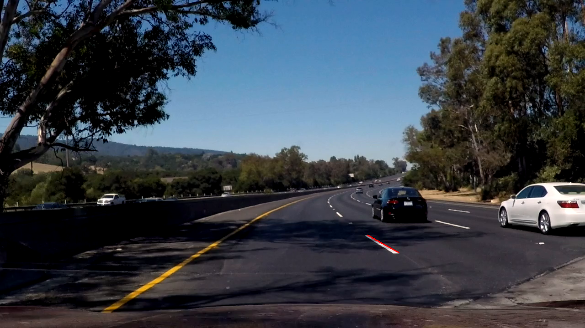

# **Finding Lane Lines on the Road**

---

**Finding Lane Lines on the Road**

The goals / steps of this project are the following:
* Make a pipeline that finds lane lines on the road
* Reflect on your work in a written report

---

### Reflection

### 1. Describe your pipeline. As part of the description, explain how you modified the draw_lines() function.

Our pipeline for processing an image that is a single frame in a video has 7 steps:
* Convert an image to grayscale.
* Apply Gaussian smoothing using 5x5 kernel.
* Detect edges using Canny edge detector.
* Reduce detected edges to the ones that are in the region of image where the lanes are supposed to be.
* Run Hough transform on the set of edges found in the previous step and identify line segments
that can be a part of the lanes.
* Use line segments found in the previous step and the lane lines found in the previous frame to generate up to 2 continuous lines that represent lanes in the current frame.  
* Draw the continuous lines found in the previous step over the original image.

In order to draw continuous lane lines we modified the draw_lines() function. The new function is called draw_lines_continuous() and has seven steps. We use the following image from the challenge video to illustrate the steps of creating continuous lines:

<p align="center"> 

</p>
<br>    

**Step 1.**  We split the image into two equal parts, left and right. We try to find a right lane line in the right part and left lane line in the left part. Notice that when the car drifts and the left lane appears in the right part of the image (or when the right lane appears in the left part of the image), one or both lane lines will not be detected. This might be a signal that the car is not in the right position.    
<br>
<p align="center">

</p>
<p align="center">
All lines detected by Canny edge detector and Hough transform.
</p>
<br>

**Step 2.** Based on previous experiments, we assume that the left and right lane lines have slopes in ranges
[-0.75, -0.55] and [0.55, 0.75] respectively. We remove all line segments with the slopes outside of these ranges.
<br>
<p align="center">

</p>
<p align="center">
Left part of the image: lines with the slopes similar to lane lines.
</p>
<br>
<p align="center">

</p>
<p align="center">
Right part of the image: lines with the slopes similar to lane lines.
</p>
<br>

**Step 3.** We build histogram of the slopes of detected lines and find the most common range of slopes (e.g. (0.61,0.66)). We use 3 bins for creating histograms. We remove all line segments with the slopes outside of the most common range of slopes.
<br>
<p align="center">

</p>
<p align="center">
Left part of the image: lines in the most common range of slopes.
</p>
<br>
<p align="center">

</p>
<p align="center">
Right part of the image: lines in the most common range of slopes.
</p>
<br>

**Step 4.** We create a continuous line that connects minimal and maximal x and y points of the line segments in the previously found most common range of slopes. If the absolute value of the slope of the new continuous line is still in [0.55,0.75] range then we add this line to the list of lane line candidates.  
<br>
<p align="center">

</p>
<p align="center">
Left part of the image: continuous line that connects extreme points of the line segments in the most common range of slopes.
</p>
<br>
<p align="center">

</p>
<p align="center">
Right part of the image: continuous line that connects extreme points of the line segments in the most common range of slopes.
</p>
<br>

**Step 5.** We use the function extend_lines() to extend the candidate lines to have the same minimal and maximal y coordinates. After this extension we have up to two continuous lines that represent lanes in the current frame. These are still not the continuous lines that are drawn in the image

<p align="center">

</p>
<p align="center">
Extended lines.
</p>
<br>

**Step 6.** After detecting the lanes in the current frame, we average them with the lanes drawn in the previous frame using the formula:    

```
right/left lane in the current frame =
(1-alpha) * right/left lane drawn in the previous frame +
alpha * right/left lane in the current frame
```    

If at step B we didn't find any candidate for the left or right lane line in the current frame then we define the corresponding lane line at the current frame as the one that was drawn in the previous frame. We also use an expiration counter to limit the number of frames where we show exactly the same lane. When the lane is updated the counter is set to its maximal value. When there is no update, i.e. when we could not detect a lane in the current frame, the counter is reduced by one. When the counter reaches zero value we delete the previously detected lane.  
<br>
<p align="center">

</p>
<p align="center">
Weighted average of extended lines and the lines drawn in the previous frame.
</p>
<br>
    
**Step 7.** Finally we use the function extend_lines() one more time to extend the lanes in the current frame to have the same minimal and maximal y coordinates. The lanes lines after this extension are the final ones and are drawn over the black image.  
<br>
<p align="center">

</p>
<p align="center">
Final lines that are drawn in the current image.
</p>

### 2. Identify potential shortcomings with your current pipeline

Our approach assumes that
1. lanes generate multiple line segments after Hough transform
2. there are no other lines in the image that have a slope that is similar to the one of lanes
3. the slope of line segments of lanes is the most frequent slope of the line segments detected by Hough transform.

If any of these assumptions does not hold then our code might generate lanes in the wrong location. In this project we tuned hyperparameters so that the location of the detected lanes is almost always accurate. But still there are several frames where there is a visible difference between the detected frame and the true one.

Additional shortcoming is that we use the lanes from the previous frames as a backup when no lanes are detected in the current frame. If we don't detect lanes for multiple frames then we show lanes from several frames ago. These frames might not be accurate.

Finally, in this project we tested the code only over the videos with a light traffic. When the traffic is high, there could be multiple cars that change lanes and occlude lane lines. Since we didn't test our code over such cases, it is hard to predict how accurate our lane detection would be when the traffic is high.

### 3. Suggest possible improvements to your pipeline

Lanes usually generate parallel line segments after Hough transform. A possible improvement would be to try to detect these parallel segments. If we don't detect parallel line segment we can fall back to the existing code for lane detection.

Another potential improvement could be to leverage commonly used colors of lanes (e.g. white and yellow) to filter out edges and lines that result from poor road quality and shades.

Finally, we can create a ground truth dataset of images with marked lanes and tune all hyperparameters automatically to optimize lane detection accuracy.
